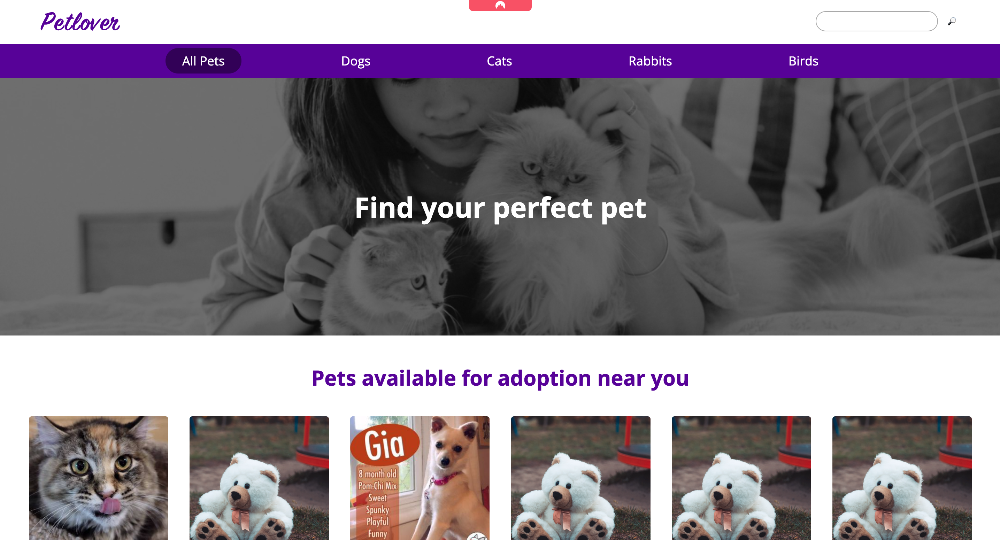

# Pet Adoption App

This is a simple pet adoption web application built using React and React Router.



## Table of Contents

- [Installation](#installation)

## Installation

To run this project locally, follow these steps:

1. Clone the repository to your local machine:

```bash
git clone https://github.com/your-username/pet-adoption-app.git

cd pet-adoption-app

npm start
